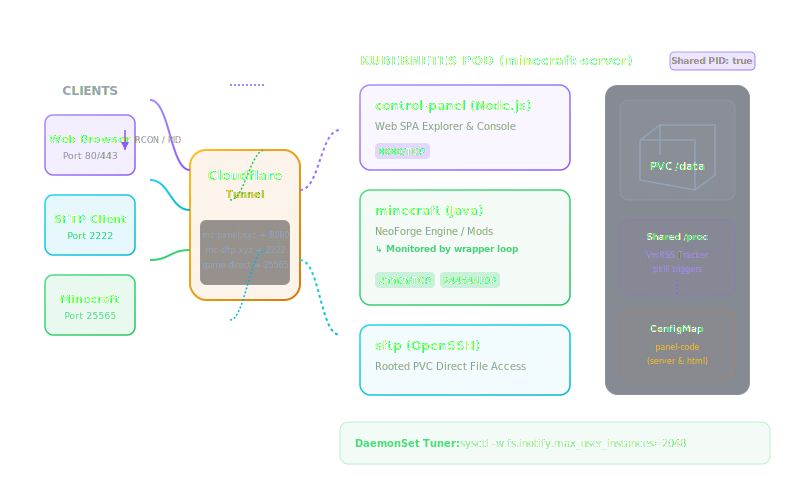

# xyz-minecraft-panel 🎮✨

A premium, ultra-lightweight, and secure **Minecraft Web Control Panel & SFTP Sidecar** architecture designed for Kubernetes (K3s). 

It features real-time log streaming (SSE), a file explorer with drag-and-drop uploads, an in-browser code editor, RCON console execution, SLP status polling, and state-loop wrapper controls to safely stop, start, and restart your server without bringing down the sidecars.



---

## 🌟 Key Features

* **Glassmorphic SPA Interface**: High-fidelity dark mode with modern typography, smooth transition animations, and real-time statistics (RAM usage, online players, CPU status).
* **RCON Web Console**: Direct command execution line that sends admin command strings directly to the NeoForge console via RCON.
* **Server List Ping (SLP) Polling**: Status queries (running, starting, offline) are polled on the game port (`25565`) instead of RCON. This **completely eliminates RCON connection log spam** (`Thread RCON Client started/shutting down`) in the console every 5 seconds.
* **Dynamic Java Memory Tracking**: Automatically scans `/proc` in the shared process namespace to track the **RSS (Resident Set Size)** memory of the `java` process. It parses `/data/user_jvm_args.txt` to retrieve your custom `-Xmx` memory limits, ensuring the RAM progress bar displays the exact utilization of the Minecraft server process (e.g. `2.4 / 6.0 GB`) rather than the host node's limits.
* **Power Controls (Start / Stop / Restart)**: A lime-green/red toggle button controls the Java process state dynamically. If stopped, the wrapper loop inside the `minecraft` container goes into sleep mode without exiting. If started, it launches the Java execution.
* **Web File Manager**: Full-featured directory browser. Supports navigating paths, deleting files, making directories, drag-and-drop uploads, downloading files, and editing configurations using an in-browser floating text editor.
* **Root-Level SFTP Sidecar**: Run an independent `sftp` container inside the Pod jailed to the PVC. Configured with matching UID/GID root-level credentials to resolve write/edit permissions across files modified by Java, Node.js, and OpenSSH.

---

## 📂 Project Structure

```text
xyz-minecraft-panel/
├── kubernetes/
│   ├── configmap.yaml             # Pre-rendered Node.js server and SPA HTML code
│   ├── deployment.yaml            # 3-container Pod Manifest with process namespace sharing
│   ├── service.yaml               # ClusterIP exposure (25565, 24454, 8080, 2222)
│   ├── cloudflared-config.yaml    # Ingress routing rules for Cloudflared
│   └── node-sysctl-tuner.yaml     # DaemonSet to tune node inotify watch allocations
├── panel/
│   ├── server.js                  # Node.js HTTP backend api
│   └── index.html                 # Frontend Glassmorphic dashboard Single Page Application
├── LICENSE                        # MIT License
└── README.md                      # Documentation
```

---

## 🚀 Deployment Guide

### Step 1: Tune Node Inotify Limits
Heavily modded packs (like Mekanism, Create, Modern Industrialization) use multiple configurations and track them dynamically using the `nightconfig` Java filewatcher. This will exhaust standard Linux `inotify` limits and crash the server with `WatchingException`.

Apply the sysctl tuner DaemonSet to automatically scale up limits across all cluster hosts:
```bash
kubectl apply -f kubernetes/node-sysctl-tuner.yaml
```

### Step 2: Create the Persistent Volume Claim
Ensure you have a PVC named `minecraft-data` inside the `gaming` namespace:
```yaml
apiVersion: v1
kind: PersistentVolumeClaim
metadata:
  name: minecraft-data
  namespace: gaming
spec:
  accessModes:
    - ReadWriteOnce
  resources:
    requests:
      storage: 20Gi # Adjust to your needs
```

### Step 3: Deploy the Code ConfigMap
Deploy the pre-rendered configmap containing the Node.js server and dashboard frontend assets:
```bash
kubectl apply -f kubernetes/configmap.yaml
```
*(Alternatively, you can compile it yourself from the `/panel` files)*:
```bash
kubectl create configmap minecraft-panel-config --from-file=panel/server.js --from-file=panel/index.html -n gaming --dry-run=client -o yaml | kubectl apply -f -
```

### Step 4: Configure Cloudflare Ingress Routing
Update [cloudflared-config.yaml](kubernetes/cloudflared-config.yaml) with your actual Cloudflare Tunnel UUID and your desired subdomains:
```bash
kubectl apply -f kubernetes/cloudflared-config.yaml
```
*Make sure to register CNAME records in your Cloudflare DNS dashboard pointing both subdomains to your `<TUNNEL-UUID>.cfargotunnel.com` address (with Proxying enabled).*

### Step 5: Deploy the Service and Pod
Apply the service definition and deployment manifests:
```bash
kubectl apply -f kubernetes/service.yaml
kubectl apply -f kubernetes/deployment.yaml
```
Once up, the Minecraft server wrapper will boot, launch the Java engine, and the panel sidecar will listen on port `8080` while SFTP listens on port `2222` (proxied to SSH container port `22`).

---

## 🛡️ Authentication & Access Defaults

* **Web UI Dashboard**: `http://mc-panel.yourdomain.com` (Credentials: `admin` / `minecraft`)
* **SFTP Connection**: `sftp://mc-sftp.yourdomain.com:2222` (Credentials: `admin` / `minecraft`)
* *Security Note: We highly recommend editing the environment variables `PANEL_USERNAME` and `PANEL_PASSWORD` in `deployment.yaml` prior to deployment, or loading them dynamically via a `Secret` resource.*

---

## 📄 License
Licensed under the [MIT License](LICENSE). Built with ❤️ by [xyz-rainbow](https://github.com/xyz-rainbow).
